# ⚡ Hyper Menu

1. [Overview](#overview)
2. [Quick Start](#-quick-start-)
3. [Main Features](#-main-features)
   - [Search](#-search)
   - [Hotkeys](#-hotkeys)
   - [History](#-history)
   - [Favorites](#-favorites)
   - [Multiple Functions Execution](#-multiple-functions-execution-shift)
   - [Build Custom Menu Items](#-creating-custom-menu-items)
   - [Single Window Mode](#single-window-mode)
   - [Extra Functions](#-extra-functions)
   - [Support](#️-support)


## 🔍Overview

Video Presentation: 

https://youtu.be/y-Hbi30_X5o

HyperMenu is an improved version of Unity’s Main Menu with a lot of useful features.
For example, you can execute non-static functions on target GameObjects or ScriptableObjects.

- Quickly navigate and execute Unity's built-in Menu Items using Hotkeys, Search, History, and Favorites
- Create own custom Menu Items with Icons, Shortcuts, Tooltips, RichText support
- Creating own workflow

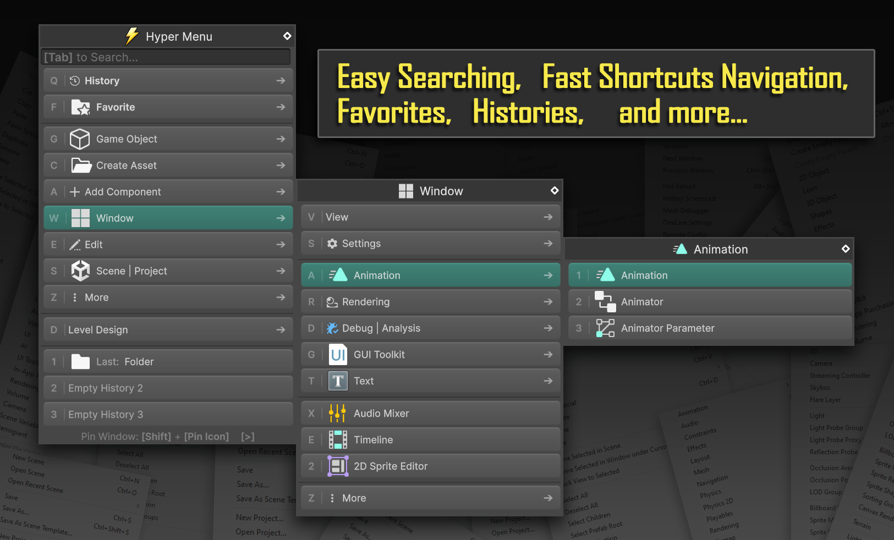


## ⚡ Quick Start ⚡
Let's see how to fast create Folder and C# Script

Press `[F1]`  to Open Hyper Menu, then:

Press `[C]` > `[F]` to execute: `C`reate Asset/`F`older

Press `[C]` > `[C]` to execute `C`reate Asset/`C`# Script

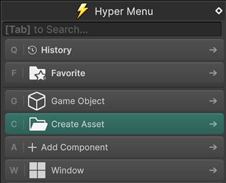
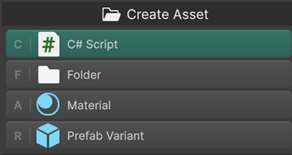


>Also, you can use [Shift] for Multiple Execution:

### Search [ Tab ]

  ##### Regular search
  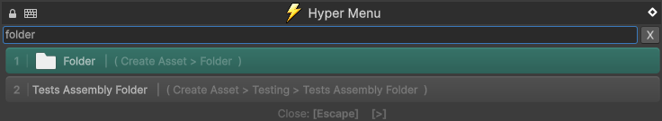


<details>
  <summary> Faster Way: Acronyms or Edge Letters (Click to Expande)</summary>

   -  for single word) 
  ` + "fr"` (first and last letters of "<b><u>f</u></b>olde<b><u>r</u></b>" )
  - > [F1] + [Tab] + [fr] + [Enter]

  -  for 2+ words use acronyms
  ` + "cs"` (acronym of "<u>C</u># <u>S</u>cript") 
  - > [F1] + [Tab] + [cs] + [Enter]

</details>


### Navigation: 
  Navigate with: `[Alt] + [WASD]` or `[Arrow Keys]` Execute `[Enter]` or `[Space]` 
  ### Re - Execute Last Items:
  - Press `[F1] + [1]`
  - Press `[F1] + [2]`
  - Press `[F1] + [3]`


  
> Run several function at once with [Shift] key hold


# 🧰 Main Features


### 🔥 Hotkeys

1. [Hotkeys] in are very fast and efficient. 
Everything can be done with hotkeys without single mouse click with one left hand:
Any Item has it's own Shorcut. Example: `[ F | Folder ]` means that hotkey is `[F]`
So, to navigate to [C]Create Asset > [F]Folder : Simply press [C] + [F]
2. Navigation, can be done with [Arrows] or [Alt]+[WASD]

#### Basic Shortcuts:

| Action                        | Shortcut            | 
|-----------------------------|---------------------|
| Open              | [F1] *(configurable)* |
| Navigate              | [Arrows] or [Alt] + [WASD] |
| Execute                | [Space] or [Enter]          |
| Mutiple Execution                 | Hold [Shift] before Execute          |
| Search  | [Tab]             |
| Close Menu                | [Escape]          |
| Do Not Close Menu                | Hold [Shift]          |
| Repeat Last                 | Alphas: [1] [2] [3] etc..          |


#### Additional Shortcuts:

| Action                        | Shortcut            | Additional |
|-----------------------------|---------------------|---------------|
| Single Window Mode                 | [Shift]+[Space]          | 
| Pin                  | [Shift]+[Space]+[Space]          | 
| Unpin                  | [Escape]          | 
| Extras (Go To Defenition, Select Targets)                 | [Middle Mouse Button]          | [Alt] + [Enter] or [Alt] + [Right Click]
| Make Item Favorite                 | [Right Mouse Button]          | [Ctrl] + [Enter] or [Ctrl]+[Space]


Each item has its own shortcut. Pressing it will Open menu group or Execute Item

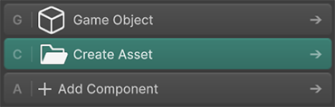 


Put Mouse over at the bottom tips to see some List of Hotkeys:

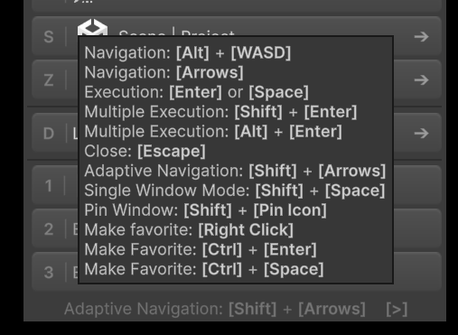


## 🔍 Search

When the menu opens, press `[Tab]` to activate Search Mode.
> When menu appears, Search Field appears right under mouse cursor, so You can press [LMB] to Start Search

- Supports acronym:
  - `"3o"` → `"3D Objects"`
  - `"cs"` → `"C# Script"`

  - `"pm"` → `"[P]ackage [M]anager"`
  - `"bs"` → `"[B]uild [S]ettings"`  

- For single words you can type first and last letters
  - `"fr"` → `"[F]olde[r]"` 
  - `"pb"` → `"[P]refa[b]"`  

Search supports all standart features:
`Hotkeys Navigation | Make Favorite | Go To Definition | Single Window Mode` etc...

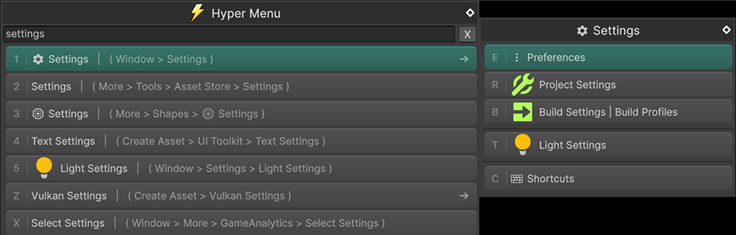

---


## 🕒 History
HyperMenu records recently used items
It’s available both in the `Main Menu` (up to 3 recent functions by default) and in the `[Q]History` tab, which stores the last 10 executed functions.
The number of recent functions shown in the main menu can be increased up to 10 in HyperMenu settings 

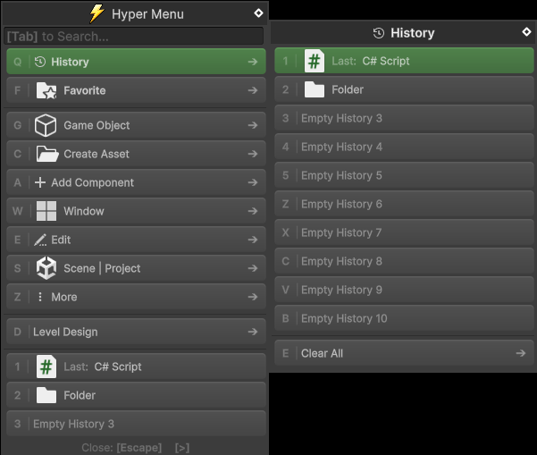
- Re-execute last 3 items: Press `[1]`, `[2]`, or `[3]` at the root menu of Hyper Menu.
    > Recent Items can be expanded at initial screen up to 10 here: 
    >  More > Hyper Menu Settings> Recent items  ( Shortcuts: [Z] + [Z] + [4] )
- Full history (up to 10 items) can be accessed in `[ [Q] History tab ]` :


<details>
  <summary>▶ Show History Hotkeys</summary>


| Slot        | Shortcut         |
|-------------|------------------|
| 1st         | [1] or [Q]+[1] |
| 2nd         | [2] or [Q]+[2] |
| 3rd         | [3] or [Q]+[3] |
| 4th         | [Q]+[4]        |
| 5th         | [Q]+[5]        |
| 6th         | [Q]+[Z]        |
| 7th         | [Q]+[X]        |
| 8th         | [Q]+[C]        |
| 9th         | [Q]+[V]        |
| 10th        | [Q]+[B]        |


</details>
---


## ⭐ Favorites

Items or Groups can be marked as **Favorites**.

**To Assign:**

**1.** `[Right Click]` on any Item, then Yellow Menu will appear. Meaning that you are in `[Favorite Zone]`
  - > Can be assigned via History items as well 
  - > Hotkeys: 
  [Ctrl] + [Enter] or 
      [Ctrl] + [Space]   

**2.** Choose any Favorite slot  (It will be overriden)

**To Access:** Press [F] + from [1] to [5] and from [Z] to [B]

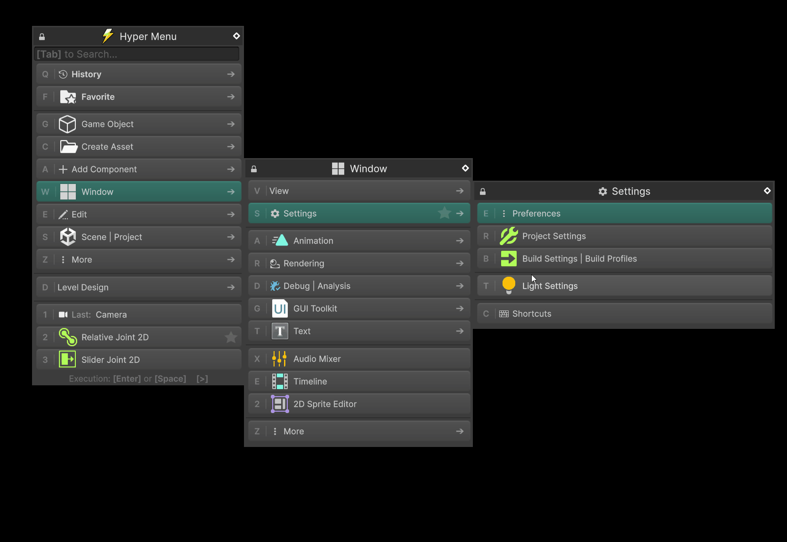

- Right-click on an item and select **Favorite Slot**
    > Or: `[Ctrl] + [Enter]`
- Access them from the **Favorite Tab** (`[F]`)

<details>
  <summary>▶ Show History Hotkeys</summary>

| Slot        | Shortcut         |
|-------------|------------------|
| 1st         | [ F ] + [ 1 ]        |
| 2nd         | [ F ] + [ 2 ]        |
| 3rd         | [ F ] + [ 3 ]        |
| 4th         | [ F ] + [ 4 ]        |
| 5th         | [ F ] + [ 5 ]        |
| 6th         | [ F ] + [ Z ]        |
| 7th         | [ F ] + [ X ]        |
| 8th         | [ F ] + [ C ]        |
| 9th         | [ F ] + [ V ]        |
| 10th        | [ F ] + [ B ]        |

</details>


## 🔄 Multiple Functions Execution [`Shift`]

By default, the HyperMenu window will `[ Close ]` after executing menu item or when menu loses focus. 
Unless you hold `[ Shift ]`:
> 

- Execute multiple commands in a row
- Do not close window on focus lost
- Open multiple windows
  - Press `[F1]` to Open new Hyper Menu window
  - Each instance will stay open independently

- 📌 **Pin the window permanently:**
  - Click the **Pin icon** (top-left corner) while holding [`Shift`]
  - The menu will stay open until `[Escape]` is pressed


## 🧱 Creating Custom Menu Items 
Any MenuItem created with [MenuItem] or [CreateAssetMenu] attributes will be added to HyperMenu by default.

Also, you can use  `[HyperMenuItem]` attribute. The attribute keeps Unity’s main menu clean. 
Also, it accepts Non-Static Methods, Hotkey, Icon, Tooltip, and supports Rich Text.

Examples available at: `HyperMenu.Example > HyperMenuExample_Warrior.cs`

## 📄 Static Methods

```csharp
using HyperMenu;
using UnityEngine;

/// <summary>
/// HyperMenu attribute can be on static methods which not requires a target for execute
/// </summary>
public static class HyperMenuExample_TimeManager
{
    /// <summary>
    /// Simply put a path to this method separated with Slash [/] symbol. 
    /// You can add a single letter in the beginning as a hotkey in square brackets [A]-[Z] [1]-[9]. 
    /// Otherwise hotkey will be assigned automatically
    /// NOTICE
    /// One simple letter as hotkey in square brackets is allowed. Don't use multiple letters: [F1]/[Ctrl]/[DEL]/[Shift] etc.. 
    /// Don't use square brackets and slash symbols in naming
    /// </summary>
    [HyperMenuItem("[D]Level Design/[T]Time/[S]Slow")]
    public static void SetTimeScale50()
    {
        Time.timeScale = 0.50f;
    }

    /// <summary>
    /// Icon. Either:
    /// 1. Put the file name without extension of icon located in any Resources folder
    /// 1.1 If you don't want to include Icon in build then put it into any Editor folder: Editor/Resources 
    /// 2. Use built-in UnityEditor icon name: https://github.com/halak/unity-editor-icons   
    /// </summary>
    [HyperMenuItem("[D]Level Design/[T]Time/[R]Reset", iconFileName: "d_Refresh")]
    public static void TimeScaleReset()
    {
        Time.timeScale = 1.00f;
    }
}
```

## 📄 Instance Methods (Non-Static)


```csharp
/// <summary>
/// HyperMenu attribute can be on Instance (non-Static) methods as well
/// In this case they should be in MonoBehaviour or Unity.Object derived class
/// Before executing the MenuItem make sure to select appropriate object of type
/// Otherwise (if nothing selected) target object will be find in scene automatically and execute method on it (which can lead to unexpected behaviour)
/// </summary>
public class HyperMenuExample_Warrior : MonoBehaviour
{
    public int health = 0;
    public int armor = 0;

    /// <summary>
    /// Hint. By hovering mouse, user will see what this method is for.
    /// Priority. The lower the priority, the higher it is located
    /// Separator. Separate this item, from items located below
    /// </summary>
    [HyperMenuItem("[D]Level Design/[W]Warrior/Full Recover Health", iconFileName: "healthIcon", hasSeparator: true, hint: "Give 100 HP to Warrior")]
    public void Health_FullRecover()
    {
        health = 100;
        Debug.Log($"Health recovered. Current value {health}");
    }

    [HyperMenuItem("[D]Level Design/[W]Warrior/Health Add", iconFileName: "healthIcon", hint: "Gives 1 HP to selected warrior")]
    public void Health_Add()
    {
        health++;
        Debug.Log($"Health added. Current value {health}");
    }

    [HyperMenuItem("[D]Level Design/[W]Warrior/Shield Add", iconFileName: "shieldIcon", hint: "Gives 1 armor to selected warrior", priority: 1000, hasSeparator: true)]
    public void Armor_Add()
    {
        armor++;
        Debug.Log($"Armor added. Current value {armor}");
    }
}
```


## 🧠 Smart Use
(for Non-Static methods only)

For non-static methods, you need to select a target instance of the declaring class.
No worries — just pick it once, and HyperMenu will remember your choice for future use.
Next time you call the function, if no target is currently selected, the previously chosen one will be used automatically.
If you want to re-select the previously executed target, press Alt + Enter or Alt + Left Click on a non-static function and choose Select Targets.

## ⚙️ Settings
  Press [F1] + [Z] + [Z] for HyperMenu settings.

  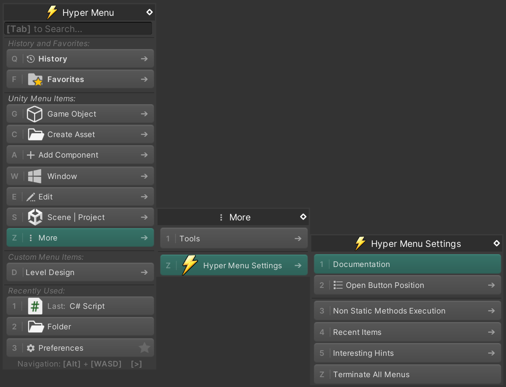

## Single Window Mode
Press on Diamond Icon at top-right corner to switch between Single/Multiple Mode (or [Shift] + [Space]).
Use 1 window instead of multiple. Very efficient if you want to keep you workplace clear. Single window is [`Pinned`] automatically

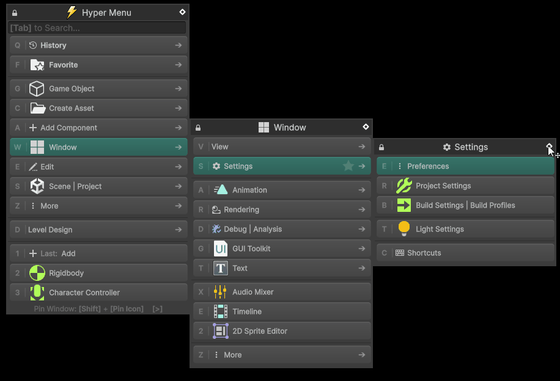

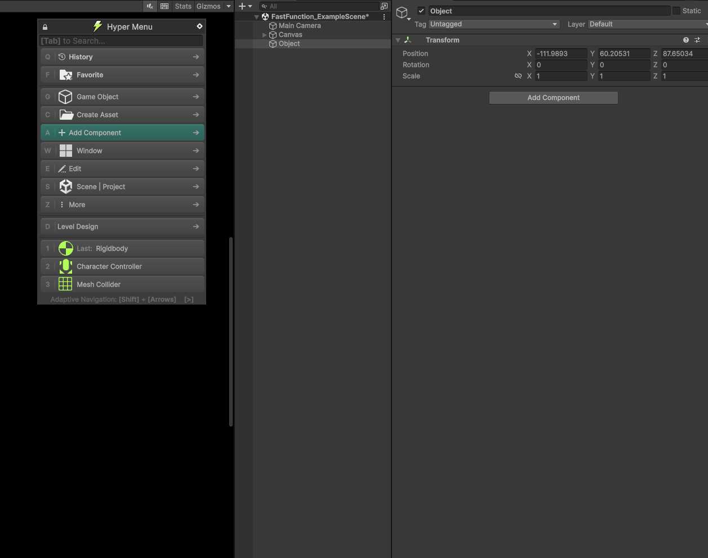

---

## 🔍 Extra Functions

Press **[Middle Mouse Button]** or **[Alt+RMB]** or **[Alt+Enter]** on Menu Item to open extra functions menu:
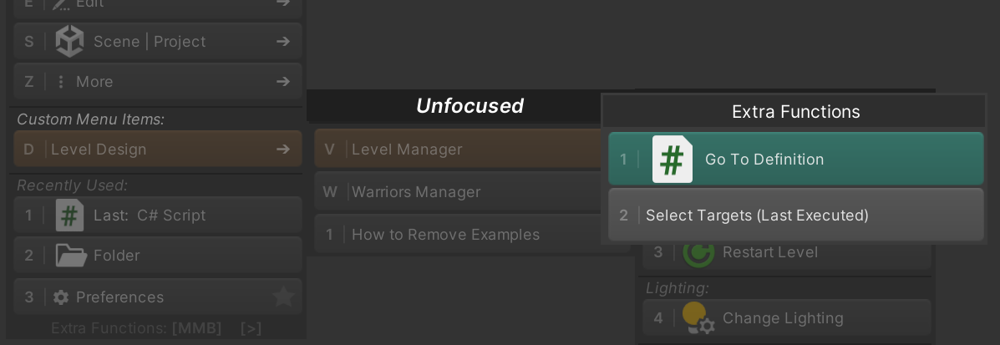

- Go to Definition: go to definition of Method or Classes that uses `[MenuItem] [CreateAsset] [HyperMenuItem]` attributes... 

  ⚠️ Not available for internal Unity menu items like **Create > Folder**
- Select Targets: select previous executed targets of this MenuItem.  

  ⚠️ Not available for Static Methods. Only Instance (Non-Static) Methods


---

# 🛠️ Support

- Tested and Developed in: Windows: Unity 2021 | Unity2022 | Unity 6 | Unity 6.1 | Unity 6.2
- MacOS: Experimental support added. I think it should work. But I'm not sure because I don't have a Mac, so, use it at your own risk


- 💬 For Questions and Support: dincrid@gmail.com


